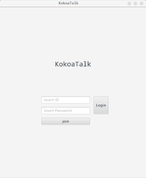

# kokoaTalk-Client

# Content

Messanger app using JavaFX and TCP/IP (Client Side)

# How this App Consists of

* Login Panel

* Join Panel

* UserManage Panel

* ChatroomManage Panel

* ChattingRoom Panel

# Details of this App

# soon Updated 

Modulize remove

Divide into smaller Methods 