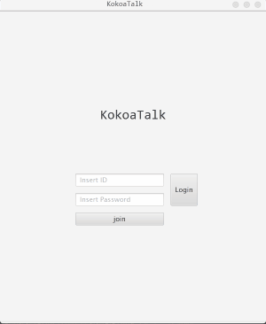

# kokoaTalk-Client

# Content

Messanger app using JavaFX and Socket (Client Side)

# How this App Consists of

* Login Panel

* Join Panel

* UserManage Panel

* ChatroomManage Panel

* ChattingRoom Panel

# Details of this App

* Login Panel

*Such ID Doesn't Exist*

*Wrong Password*

*Enter UserID*

*Enter UserPassword*

* Join Panel

*ID Already Exists*

*Password Not Secure*

*Fields not Filled*

*Password Not Same*

* UserManage Panel

*Refresh Connection Status*

*Cannot add Yourself*

*Already Added*

* ChatroomManage Panel

*No Chatroom Chosen*

*Choose ONE Chatroom*

*Chatroom Already Added*

# soon Updated 

Chatroom showing last message

Chatroom real time Alarm (Auto Created to Other Members at First Msg)

Friend Status real time Update

sending Various Files Through message